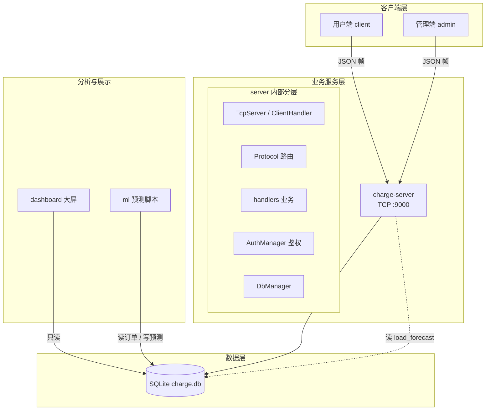
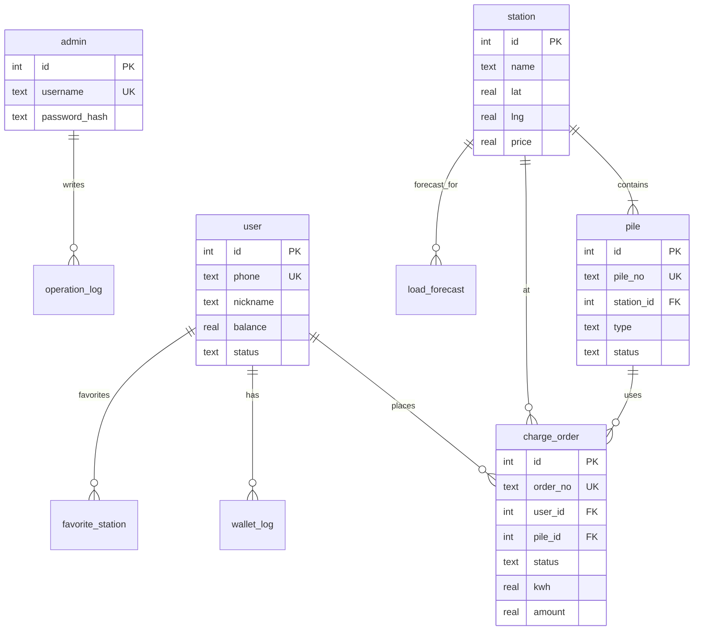

# 系统概要设计

> 东软电动汽车充电桩应用管理平台  
> 版本：v0.1  
> 关联文档：[Socket 协议](protocal.md) · [数据库脚本](../db/schema.sql)

---

## 1. 项目概述

本系统面向电动汽车充电场景，提供 **用户找桩充电**、**运营后台管理**、**数据可视化大屏** 与 **负荷预测/智能推荐** 等功能。采用 **C/S 架构**：桌面客户端经 TCP 访问统一业务服务，服务层集中读写 SQLite；大屏与 ML 脚本以只读或批处理方式使用同一数据库。

| 子系统 | 目录 | 技术 | 负责人 |
|--------|------|------|--------|
| 充电用户端 | `client/` | Qt Widgets + QWebEngineView（地图） | 组员 A |
| PC 管理端 | `admin/` | Qt Widgets + QChart | 组员 B |
| Socket 业务服务 | `server/` | Qt Network + QSQLITE | 组员 C |
| 数据库脚本 | `db/` | SQLite 3 | 组长 / 组员 C |
| 可视化大屏 | `dashboard/` | Flask + ECharts | 组员 D |
| 机器学习 | `ml/` | Python | 组员 D |

---

## 2. 总体架构



### 2.1 核心设计原则

1. **用户端 / 管理端不直连数据库**，所有业务经 `server` 统一入口，便于鉴权、事务与日志。
2. **协议先行**：接口变更顺序为 `docs/protocal.md` → `server/` → `client/` / `admin/`。
3. **数据库各人生成**：`charge.db` 不提交 Git，由 `schema.sql` + `seed.sql` 本地构建。
4. **大屏 / ML 弱耦合**：可独立部署，通过数据库表 `load_forecast`、`ads_daily_stats` 与服务端解耦。

---

## 3. 目录结构

```text
task_ShortSemester/
├── docs/
│   ├── architecture.md      # 本文档（概要设计）
│   └── protocal.md          # Socket JSON 协议
├── db/
│   ├── schema.sql           # 建表
│   ├── seed.sql             # 演示数据
│   └── charge.db            # 本地生成，已 gitignore
├── server/                  # 业务中台（已实现 P0）
│   ├── main.cpp
│   ├── tcpserver.*          # 监听 9000
│   ├── clienthandler.*      # 单连接收发、粘包处理
│   ├── protocol.*           # 帧编解码 + cmd 路由
│   ├── authmanager.*        # token 会话
│   ├── dbmanager.*          # QSQLITE 封装
│   └── handlers/            # 各 cmd 业务实现
├── client/                  # 用户端（待开发）
├── admin/                   # 管理端（待开发）
├── dashboard/               # Web 大屏（待开发）
├── ml/                      # 预测脚本（待开发）
├── tools/
│   └── test_server.py       # P0 协议测试客户端
└── TaskArrangement.xls      # 需求进度 / 分工表
```

---

## 4. server 内部分层

```text
┌─────────────┐     TCP:9000      ┌──────────────────────────────────┐
│ client/admin│ ── length+JSON ──► │ charge-server                    │
└─────────────┘                   │                                  │
                                  │  TcpServer                       │
                                  │    └─ ClientHandler（每连接一个）  │
                                  │         └─ Protocol::handleRequest│
                                  │              └─ handlers/*        │
                                  │              └─ AuthManager       │
                                  │              └─ DbManager → DB    │
                                  └──────────────────────────────────┘
```

| 模块 | 职责 |
|------|------|
| `TcpServer` | `QTcpServer` 监听端口，接受连接并创建 `ClientHandler` |
| `ClientHandler` | 维护接收缓冲区，按 4 字节大端长度拆包，调用协议层 |
| `Protocol` | JSON 帧编解码；根据 `cmd` 分发到对应 handler |
| `AuthManager` | 登录后颁发 UUID token；校验用户/管理员角色 |
| `DbManager` | 单例打开 `db/charge.db`；执行 SQL |
| `handlers/*` | 具体业务：登录、找桩、充电、统计等 |

---

## 5. 通信协议概要

- **传输**：TCP，`127.0.0.1:9000`（或虚拟机 IP）
- **帧格式**：`uint32_be(length) + UTF-8 JSON`
- **请求字段**：`id`、`cmd`、`token`（可选）、`data`
- **响应**：`ok: true/false`，失败时带 `error.code` / `error.message`

命令按阶段划分：

| 阶段 | 状态 | 典型命令 |
|------|------|----------|
| **P0** | 已实现 | `ping`、`user.login`、`admin.login` |
| **P1** | 第 2–3 周 | `station.*`、`charge.*`、`user.*`、`stats.*`、`pile.*` |
| **P2** | 加分 | 收藏、预测、推送、电桩 CRUD 等 |

完整字段定义见 [protocal.md](protocal.md)。

---

## 6. 数据模型

### 6.1 ER 关系（逻辑）



### 6.2 核心表说明

| 表 | 用途 |
|----|------|
| `admin` | 管理员账号，密码 SHA256 存储 |
| `user` | 手机号用户，余额、冻结状态 |
| `station` / `pile` | 充电站与电桩，含经纬度、电价、桩状态 |
| `charge_order` | 订单全生命周期：预约 → 充电中 → 待支付 → 已完成 |
| `wallet_log` | 充值与扣款流水 |
| `favorite_station` | 用户收藏电站 |
| `operation_log` | 管理员操作审计 |
| `announcement` | 运维公告 |
| `load_forecast` | ML 写入的负荷预测 |
| `ads_daily_stats` | 大屏日聚合指标 |

### 6.3 订单状态机

```text
预约 ──启动──► 充电中 ──停止──► 待支付 ──结算──► 已完成
                  │                    │
                  └──── 余额不足 ────────┘
```

- 同一用户同时仅允许一笔「充电中 / 待支付」类未完成订单（由 `order.check_open` 拦截）。
- 结算时：扣减 `user.balance`，写 `wallet_log`，释放电桩为「闲置」。

---

## 7. 各子系统职责

### 7.1 用户端 `client/`

- 手机号免密登录、个人资料、充值
- 定位 / 地址 → 附近电站列表与详情
- 预约、启动、停止充电；实时进度展示
- 订单历史、收藏、一键导航（QWebEngineView + 地图 API）
- 通过 `ApiClient` 与 server 通信（逻辑参考 `tools/test_server.py`）

### 7.2 管理端 `admin/`

- 管理员登录、KPI 与 QChart 图表
- 电桩 / 电站 / 用户管理，远程重启、冻结
- 操作日志、公告发布、负荷预警展示

### 7.3 业务服务 `server/`

- 全部 `cmd` 的实现与数据库事务
- 计费线程（按电量 × 电价累计，停止后结算）
- 统一异常码与参数校验

### 7.4 大屏 `dashboard/`

- Flask 提供 Web 页面，ECharts 展示营收、桩状态、负荷等
- 优先读 `ads_daily_stats`、`load_forecast`，避免高频扫订单大表

### 7.5 机器学习 `ml/`

- 从 `charge_order`、 `pile` 等表提取特征
- 预测未来 1h / 6h / 24h 负荷，结果写入 `load_forecast`
- 为用户端推荐与管理端预警提供数据

---

## 8. 部署与运行

### 8.1 环境

| 组件 | 要求 |
|------|------|
| OS | Linux（Ubuntu 22.04，课程验收环境） |
| Qt | 6.x（client / admin / server） |
| SQLite | 3.x，Qt 驱动 `QSQLITE` |
| Python | 3.x（测试脚本、dashboard、ml） |

### 8.2 启动顺序

```bash
# 1. 初始化数据库（每人本地一次）
cd db
sqlite3 charge.db < schema.sql
sqlite3 charge.db < seed.sql

# 2. 启动业务服务（必须先起）
cd ../server
qmake6 charge-server.pro && make -j4
./charge-server

# 3. 启动用户端 / 管理端（连接 127.0.0.1:9000）
# 4. 可选：dashboard、ml 定时任务
```

### 8.3 演示账号

| 类型 | 账号 | 说明 |
|------|------|------|
| 用户 | 13800138001 | 正常，有余额 |
| 用户 | 13800138006 | 已冻结 |
| 管理员 | admin / 123456 | 默认管理员 |

---

## 9. 安全与异常

| 项 | 措施 |
|----|------|
| 密码 | 管理员密码 SHA256 存库，不明文 |
| 鉴权 | 除登录 / ping 外必须带有效 token |
| 权限 | 用户 token 仅操作本人数据；管理员 token 可执行管理 cmd |
| 余额 | `CHECK (balance >= 0)`；结算用事务 |
| 异常 | 断网、DB 失败、余额不足等返回中文 `error.message`，客户端弹窗 |

---

## 10. 协作与版本管理

| 规则 | 说明 |
|------|------|
| 目录归属 | 每人只改自己负责的目录，避免 Git 冲突 |
| 分支 | `main` 稳定；个人用 `dev/xxx` 开发后合并 |
| 协议变更 | 先改 `protocal.md`，再改 server，最后 client/admin |
| 表结构变更 | 仅组长 / C 修改 `schema.sql`，全组重建 `charge.db` |
| 进度 | `TaskArrangement.xls` 统一维护 ○ / △ / × |

---

## 11. 实施阶段（与协议 P0/P1/P2 对齐）

| 周次 | 目标 | 交付 |
|------|------|------|
| 第 1 周 | P0 | server 跑通；双端登录 UI 骨架 |
| 第 2 周 | P1 前半 | 找桩、列表；管理端 KPI；`station.*` API |
| 第 3 周 | P1 后半 | 充电全流程、计费、管理 CRUD |
| 第 4 周 | P2 + 文档 | 大屏、预测、推荐；总结与环境报告 |

---

## 12. 文档修订记录

| 版本 | 日期 | 说明 |
|------|------|------|
| v0.1 | 2026-09-03 | 初稿：架构、模块、数据模型、部署与协作 |
